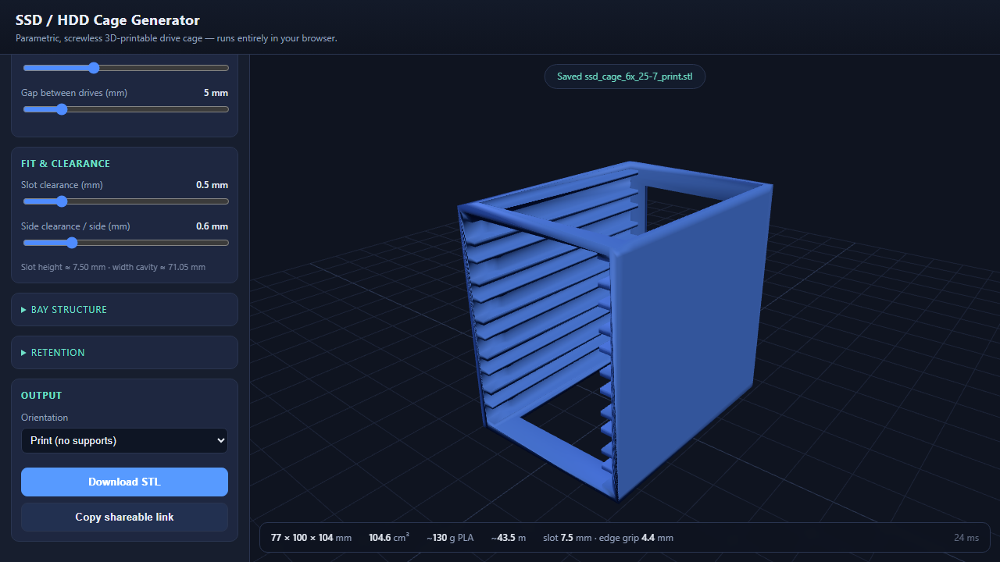

# SSD / HDD Cage Generator

A parametric, screwless, 3D-printable drive-cage generator that runs **entirely in the browser** — no server. Pick a drive type and count, set the spacing, fine-tune any dimension you like, and download a print-ready STL.



## Features

- **2.5" (7 / 9.5 / 15 mm) and 3.5"** drive presets (SFF maximum envelopes → guaranteed fit).
- **1–16 bays**, adjustable air gap.
- **Screwless friction retention** — C-channel rails capture each drive top & bottom, with ramped bumps near the mouth for grip.
- **Everything is editable.** Selecting a drive type loads that device's defaults as a starting point; then every value stays adjustable — drive W/L/thickness, clearances, wall / rail / base / back / top thicknesses, retention bumps, vents.
- **Live 3D preview** (three.js) + **binary STL export**, always in the no-support print orientation (stands on its back, slots print as vertical grooves).
- Live **size / volume / filament** estimates.
- **Shareable links** — the full configuration is encoded in the URL.

All geometry is built with [Manifold](https://github.com/elalish/manifold) (WASM CSG); the client-side output is verified watertight and matches a reference Python model exactly.

## Develop

```bash
npm install
npm run dev        # http://localhost:5173
npm run build      # -> dist/
npm run test:geo   # headless geometry validation (Node)
```

`npm run test:geo` builds several configurations in Node and prints size / volume / triangle counts. A Playwright end-to-end check (`test/verify_app.mjs`) loads the built app in headless Chromium and confirms it generates and exports without errors.

## Deploy to GitHub Pages

1. Create a repo and push this folder to the `main` branch.
2. In **Settings → Pages**, set **Source = GitHub Actions**.
3. The included workflow (`.github/workflows/deploy.yml`) builds and publishes on every push.
   Your app will be live at `https://<user>.github.io/<repo>/`.

`vite.config.js` uses `base: './'` so it works on any Pages sub-path without extra config.

## Notes on fit

Presets target the **maximum** SFF-8201 / 8301 envelope plus clearance, so any in-spec drive fits. Because print tolerances vary, print the **1-bay** configuration first as a test and adjust *slot clearance* / *side clearance* / *bump height* before committing to the full cage.

## License

MIT — see [LICENSE](LICENSE).
